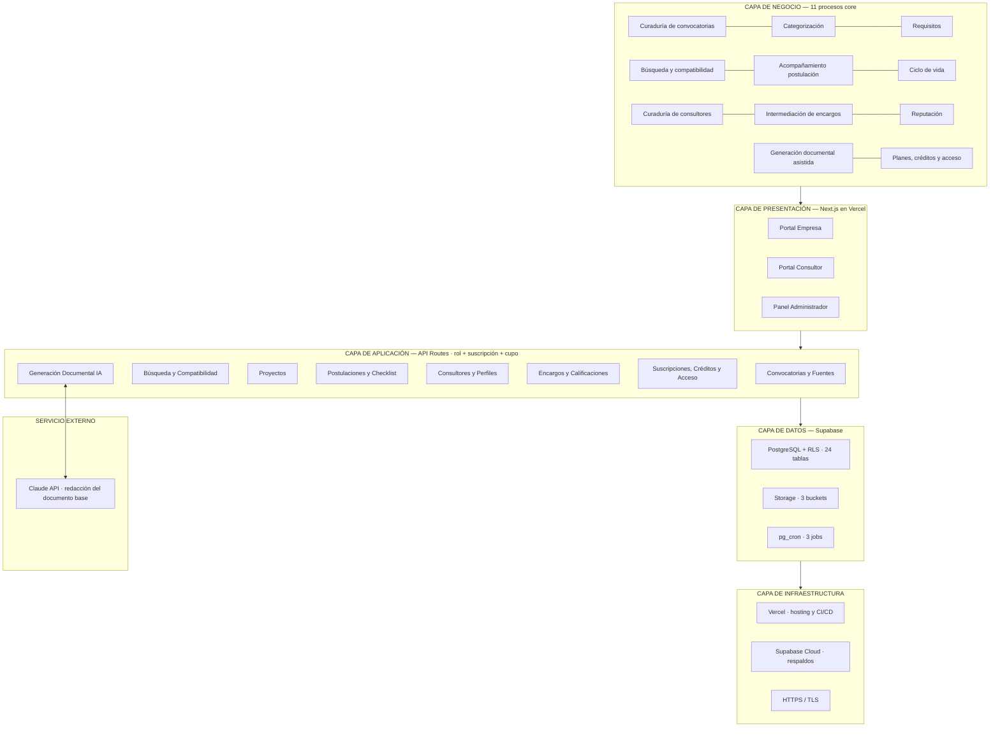

# Arquitectura de la solución

> Parte de la especificación del MVP v4 · Plataforma de Gestión de Convocatorias.
> Índice general en `docs/README.md`. Contexto rápido en `CLAUDE.md`.

---

## 8. Arquitectura de la solución

### 8.1 Vista general por capas

### 8.2 Capa de presentación — rutas

**Portal Empresa** (navbar: Convocatorias · Mis proyectos · Mis documentos · Mis postulaciones · Consultores · Mi suscripción):

| Ruta | Pantalla | CU |
|---|---|---|
| `/` | Landing con **indicadores del catálogo** y registro por rol | CU-14, CU-36 |
| `/convocatorias` | Catálogo con búsqueda, filtros y **chips sugeridos** | CU-07 |
| `/convocatorias/[id]` | Ficha con botones **"Postular"**, **"Generar documento con IA"** e **"Ir al portal de la entidad"** *(v5)* | CU-08, 11, 33 |
| `/convocatorias/[id]/generar` | Selección de proyecto, aviso de cupo y confirmación | CU-33 |
| `/proyectos` · `/proyectos/[id]` | Lista y ficha del proyecto con **indicador de completitud**, botón "Solicitar consultor" y "Generar documento para..." | CU-09, 19, 33 |
| `/proyectos/[id]/sugerencias` | Sugerencias con **% de compatibilidad** y desglose | CU-10 |
| `/documentos` | Documentos generados: proyecto, convocatoria, pendientes, versión | CU-34 |
| `/documentos/[id]` | Vista previa editable, ajustes con IA, exportar a Word, **interruptor de compartir con el consultor del encargo `en_curso`** | CU-34 |
| `/consultores` · `/consultores/[id]` | Directorio y perfil — **redes/web/CV solo con solicitud activa**; **botón "Solicitar a este consultor" con selector de proyecto o postulación (RF-74)** | CU-20, 21 |
| `/encargos` | Solicitudes y encargos + calificar | CU-22..24 |
| `/postulaciones` · `/postulaciones/[id]` | Panel y detalle con checklist, historial, botón **"Generar/Editar documento con IA"** y **"Ir al portal de la entidad"** *(v5)* | CU-12, 13 |
| `/suscripcion` | Plan, **cupo de créditos**, historial de pagos | CU-28..30 |

**Portal Consultor:** `/consultor/perfil` (editor + estado de revisión), `/consultor/encargos` (bandeja en 3 pestañas), `/consultor/documentos` (**solo los autorizados explícitamente — lectura, edición y ajustes con IA; sin botón de exportar**, RF-71/72) y `/consultor/suscripcion`.

**Panel Administrador:** dashboard ampliado con perfiles en revisión, encargos por asignar, suscripciones y **consumo de IA**; `/admin/fuentes`, `/admin/convocatorias/[id]`, `/admin/categorias`, `/admin/consultores/revision`, `/admin/consultores`, `/admin/encargos`, `/admin/planes` (con créditos), `/admin/suscripciones` (con paquetes adicionales), **`/admin/plantillas`** (editor y versiones del prompt de generación — CU-37) y **`/admin/seguridad`** (activación de MFA, eventos de seguridad y bloqueos por límite de tasa — CU-38..40, *nuevo v5*). Ninguna ruta bajo `/admin` es accesible sin MFA verificado (RNF-28).

### 8.3 Capa de aplicación — servicios y endpoints

| Servicio | Endpoints principales | Reglas |
|---|---|---|
| Convocatorias y Fuentes | `GET/POST /api/fuentes` · `GET/POST/PATCH /api/convocatorias` (incluye `urlPostulacion`, validada como `http`/`https` — RNF-29) · `POST /api/convocatorias/[id]/publicar` (400 si falta o es inválida) · `.../documentos` | RN-01, RN-07 |
| Búsqueda y Compatibilidad | `GET /api/convocatorias?filtros` · `GET /api/proyectos/[id]/sugerencias` (devuelve % y desglose) · `GET /api/indicadores` (landing, cacheado) | RN-05, RF-16, RF-44 |
| Proyectos | `GET/POST/PATCH/DELETE /api/proyectos` (incluye campos de contenido y completitud) | RLS por usuario |
| Postulaciones | `POST /api/postulaciones` · `PATCH /api/checklist/[itemId]` · `POST /api/postulaciones/[id]/estado` | RN-03, RN-04 |
| Consultores y Perfiles | `GET/PATCH /api/consultor/perfil` · `POST .../enviar-revision` · `GET /api/consultores` · `GET /api/consultores/[id]/cv` | RN-08, RN-12 |
| Encargos y Calificaciones | `POST /api/encargos` (incluye `tipoAyuda` + `convocatoriaId?` — adjunta contexto automáticamente, RF-68/69) · `.../responder` (revela `correoContacto` de la contraparte al aceptar, RF-70) · `.../avances` · `.../completar` · `.../calificar` · `POST /api/admin/encargos/[id]/asignar` (revela `correoContacto` al asignar) | RN-09, RN-10, RN-25, RN-26 |
| Suscripciones, Créditos y Acceso | `GET /api/planes` · `GET /api/suscripcion` (incluye cupo) · `POST /api/admin/suscripciones/activar` · `POST /api/admin/suscripciones/[id]/creditos` · middlewares `requireSubscription()` y **`requireCredits()`** | RN-11, RN-16, RN-17, RN-18 |
| **Generación Documental IA** | `POST /api/documentos/generar` (proyectoId + convocatoriaId) · `GET/PATCH /api/documentos/[id]` · `POST /api/documentos/[id]/ajustar` · `POST /api/documentos/[id]/compartir` / `.../revocar` (autoriza o quita al consultor — solo el dueño, solo con encargo `en_curso`, RF-71) · `GET /api/documentos/[id]/exportar` (devuelve .docx — **403 si quien llama no es el dueño**, RF-72) · `GET/POST /api/admin/plantillas` | RN-17, RN-19..22, 27, 28, RNF-23 |
| **Seguridad y auditoría** *(nuevo v5)* | Enrolamiento y verificación de MFA vía Supabase Auth (`/auth/mfa/enroll`, `/auth/mfa/verify`) · `GET /api/admin/eventos-seguridad?filtros` · `POST /api/admin/eventos-seguridad/[id]/liberar` · middlewares `requireMFA()` (toda ruta `/admin`) y `requireRateLimit()` (endpoints públicos y de generación con IA) | RNF-25..28, RN-23, RN-24 |

**Flujo interno del servicio de generación:** valida suscripción y cupo → **verifica límite de tasa (RNF-27)** → arma el contexto (proyecto + convocatoria + requisitos + texto del TDR **saneado de instrucciones incrustadas**, con tope de tamaño — RN-23) → invoca Claude API con instrucciones de veracidad y estructura → parsea el resultado y extrae los pendientes → guarda el documento y registra el consumo → descuenta el crédito. Si algo falla antes del guardado, **no se descuenta**. El .docx se genera bajo demanda desde el contenido guardado, sin ocupar un cuarto bucket.

### 8.4 Capa de datos

24 tablas con RLS **habilitado y con política explícita en todas, sin excepción** (RNF-25 — ver `docs/05-modelo-de-datos.md` §9.10 para las tablas base y §9.5 para las del módulo de IA) · Storage con 3 buckets (`documentos-convocatorias`, `fotos-consultores`, `hojas-de-vida` privado, URLs firmadas de máximo 15 min — RNF-16) · **pg_cron con 3 jobs diarios**: cierre de convocatorias, vencimiento de suscripciones con gracia y **reinicio mensual de créditos** · triggers para el rating del consultor.

La `service_role key` de Supabase —que puede saltarse RLS— se usa **únicamente** dentro de las API routes de servidor y los jobs de `pg_cron`; nunca se referencia en código de cliente ni en variables `NEXT_PUBLIC_*` (RNF-26). El límite de tasa (RNF-27) se implementa en un almacén rápido fuera de Postgres (p. ej. Upstash Redis o Vercel Edge Config); solo el bloqueo confirmado se persiste en `eventos_seguridad` para auditoría.

---

